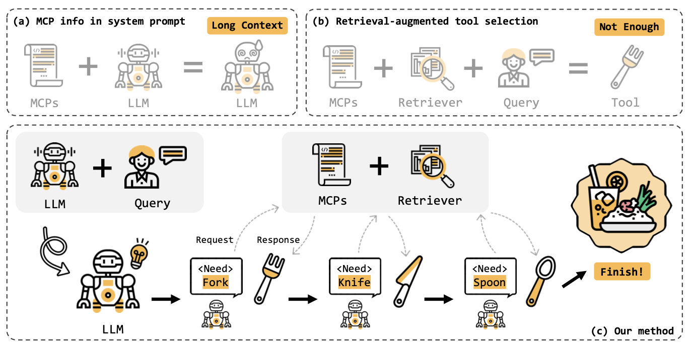

# MCP-Zero

<div style="display: flex; align-items: center; gap: 10px; margin-bottom: 10px;">
  
  <a href="https://arxiv.org/abs/2506.01056">
    
  </a>
</div>


Aha, you find the MCP-Zero so early! :D

We are working on it, and the dataset is ready to be released. Please check it out!


---


## MCP-Zero: Proactive Toolchain Construction for LLM Agents from Scratch

<div align="center">
  
  <p> Using MCP-Zero to proactively construct toolchains for "Making a great meal"</p>
</div>


## MCP-Tools

**Dataset Path**: `MCP-tools/mcp_tools_with_embedding.json`

This is the dataset containing all filtered tools from the MCP official repo. 308 servers and 2,797 tools in total.

Data structure:
```
{
  "server_name": string, // The name of the MCP server, extracted or inferred from the README
  "server_summary": string, // A summary of the server's purpose and capabilities, based on all relevant parts of the README.
  "server_description": string, // Description from metadata. 
  "description_embedding": float[3072], // The embedding of the server description from text-embedding-3-large
  "summary_embedding": float[3072], // The embedding of the server summary from text-embedding-3-large
  "tools": [
    {
      "name": string, // The function/tool name
      "description": string, // A concise description of what the tool does
      "description_embedding": float[3072], // The embedding of the tool description from text-embedding-3-large
      "parameter": { // A dictionary of input parameters, being included if explicitly defined
        "param1": "(type) description1",
        "param2": "(Optional, type) description2"
      }
    }
  ]
}
```


